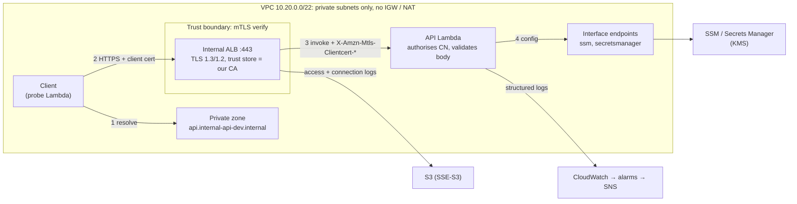

# Internal mTLS API on AWS

A VPC-only internal API that requires mutual TLS, built with Terraform and deployed through GitHub Actions using OIDC. It's structured as a platform paved road: secure-by-default modules composed into separately owned state layers.

`POST https://api.internal-api-dev.internal/` with `{"message": "..."}` returns `{"message", "timestamp", "request_id"}`. It's reachable only from inside the VPC, and only by clients holding a certificate from our CA whose CN is on the allow-list.

## Architecture



| Trust boundary | Enforced by |
|---|---|
| Network | Private subnets, no internet path, `internal = true` ALB, ALB SG accepts only the client SG |
| Authentication | ALB mTLS `verify`: the cert must chain to our CA and be in date |
| Authorisation | The Lambda checks the cert CN against an SSM allow-list |
| AWS APIs | A role per function, capped by a permissions boundary; resource policies on secrets |

## Layout

```
bootstrap/   state bucket + KMS, GitHub OIDC provider (applied once, by hand)
modules/     kms s3 cloudwatch private-vpc vpc-endpoints secrets-manager sns pki iam lambda alb
layers/      iam → base → network → app   (one state each; iam is applied by a person, never CI)
envs/<env>/  <layer>.tfbackend + <layer>.tfvars (config only)
src/         api/ and smoke_test/ Lambdas (Python 3.12)     tests/  pytest
```

## Setup

Requires Terraform ≥ 1.11, AWS CLI v2 and Python 3.12.

```bash
aws login --profile checkout --region eu-west-2
```
Terraform can't read `aws login` sessions, so add a wrapper profile to `~/.aws/config`:
```ini
[profile checkout-tf]
region = eu-west-2
credential_process = aws configure export-credentials --profile checkout --format process
```

```bash
# once: bootstrap with local state, then move it into the bucket it created
cd bootstrap && terraform init && terraform apply -var-file=bootstrap.tfvars
# uncomment backend "s3" in terraform.tf (kms_key_id = state_kms_key_arn output), then:
terraform init -migrate-state && cd ..

# alarm email (gitignored): envs/dev/base.local.tfvars → alert_emails = ["you@example.com"]
make apply ENV=dev        # iam, base, network, app in order (or make apply-<layer>)

aws lambda invoke --profile checkout --function-name internal-api-dev-smoke-test out.json && cat out.json
make check                # fmt, validate, pytest, checkov
```

**CI:**
- repository variable `AWS_PLAN_ROLE_ARN`
- repository secret `ALERT_EMAILS` (`["you@example.com"]`)
- GitHub Environment `dev`, with required reviewers, deployment branch `main`, and variable `AWS_APPLY_ROLE_ARN`

## Evidence

The probe runs in the VPC every 5 minutes. Result from an on-demand invoke:
```json
{"success": true, "checks": {"valid_request": true, "request_id": "726606b3-8311-49de-a2c8-630b233d295f",
                             "invalid_payload": true, "no_client_cert": true}}
```
The same request in the API's structured log, with the client identity passed through by the ALB:
```json
{"message": "request", "request_id": "726606b3-8311-49de-a2c8-630b233d295f", "method": "POST", "status": 200,
 "client_subject": "CN=smoke-test,O=Internal API (dev)", "client_serial": "1C8A6F571F905ED03E40158F8EC6E20B"}
```
- **mTLS:** a request without a client cert is rejected at the TLS handshake, so it never reaches Lambda.
- **Health alarm:** it went `ALARM` (12:46) → `OK` (13:10) during the first deploy. Both transitions were published to the KMS-encrypted SNS topic with 0 failures.
- **ALB logs:** ELB's access and connection log test files landed in the logs bucket.

## Design choices

- **Internal ALB, not a private API Gateway.**
  - AWS: *"Mutual TLS isn't supported for private APIs"* ([docs](https://docs.aws.amazon.com/apigateway/latest/developerguide/rest-api-mutual-tls.html)). Regional mTLS with a private cert needs an ACM ownership-verification cert, i.e. a public domain.
  - An internal ALB does mTLS `verify` natively with an imported cert, and invokes Lambda.
  - Cost: no API Gateway features or native X-Ray.
- **Authenticate at the ALB, authorise in the app.** Verify mode accepts *any* cert from the CA. The CN allow-list limits callers, and it doubles as a kill switch for a leaked cert while there's no CRL.
- **Certificates and secrets:**
  - server cert and key → **ACM** (imported; the key can't be exported back out)
  - CA cert → **S3** (SSE-KMS; its version ID pins the trust store)
  - client cert and key → **Secrets Manager**, one secret per client, readable only by that client's role and Terraform
  - CA key → Secrets Manager (break-glass)
  - config → **SSM SecureString**
  - ECDSA P-256 with key identifiers; CA 90 days, leaves 30 days
- **Private keys are in Terraform state** (the `tls` provider generates them).
  - Mitigated: a KMS-encrypted, versioned, access-restricted state bucket, and write-only secret values.
  - Solved in production by AWS Private CA (see Gaps).
- **No Lambda env vars (security).** The `lambda` module has no `environment` input, so no team can put a secret in Terraform code or state that way. Config and secrets can only come from SSM or Secrets Manager (encrypted, access-controlled, audited). Each function reads `/<its function name>/config`. The trade-off is an implicit naming link rather than explicit wiring.
- **Health = a synthetic probe, not an ALB health check.** A Lambda target health check only proves the function can be invoked, and bypasses DNS and mTLS. The probe exercises the full path and emits `ProbeSuccess` via EMF. Its alarm treats missing data as breaching. *Rejected:* a Synthetics canary (~$10/month plus a `monitoring` endpoint ~$16/month).
- **Networking:**
  - no IGW, NAT or public-subnet resources exist in the `private-vpc` module
  - endpoints only for what the code calls, plus the S3 gateway
  - SG-to-SG rules only; the endpoint SG's rules are standalone resources owned by `app`
- **NACLs are left at the default.** SGs are stateful and already least-privilege, while NACLs are stateless and subnet-wide. I'd use them for tier guardrails, known-bad CIDR denies, and inspection-VPC edges.
- **No WAF.** Only in-VPC services with a CA-signed cert can connect, and WAF's rules target internet traffic. I'd add it if the API were exposed beyond the VPC or needed per-client rate limiting.
- **No X-Ray.** An ALB has no X-Ray integration, so request IDs correlate the logs instead. The production follow-up is OpenTelemetry.
- **Terraform:**
  - **Modules** hard-code or default the secure settings (ALB internal with mTLS verify, S3 public access block, log retention ≥ 365 days for PCI DSS 10.5.1).
  - **Four states split by owner and pace of change**, with values passed through `terraform_remote_state`.
  - **PKI is in `base`**: with Private CA, nothing key-bearing is left per account.
  - **Env separation:** one root per layer plus per-env backend and tfvars files, with `allowed_account_ids`. *Rejected:* wrapper folders (duplication) and workspaces (one bucket and set of credentials for every env).
- **CI identity:**
  - `ci-plan` = `ReadOnlyAccess` plus state access.
  - `ci-apply` = `PowerUserAccess` plus IAM only for roles carrying the **workload permissions boundary**. It can't touch the CI roles, the boundary or the state backend.
  - So CI can create Lambda roles without being able to escalate.

## Observability

| Log | Where |
|---|---|
| API audit line per request: request ID, status, latency, client cert subject and serial | `/aws/lambda/internal-api-dev-api` |
| Probe results and EMF metrics | `/aws/lambda/internal-api-dev-smoke-test` |
| VPC Flow Logs / Resolver query logs | `/vpc/internal-api-dev/{flow-logs,resolver-query-logs}` |
| ALB access and connection logs, including rejected handshakes | S3 `internal-api-dev-alb-logs-…` (Athena) |

All log groups are KMS-encrypted with 365-day retention.

**Alarms**, sent to SNS:
- **the probe alarm** (the primary health signal)
- ALB TLS negotiation errors (> 5 per 5 minutes; the probe's no-cert check causes 1 per run)
- ALB target and ELB 5XX
- Lambda errors and throttles

The KMS key policy must grant `cloudwatch.amazonaws.com`, or notifications to the encrypted topic are silently dropped.

```
fields @timestamp, @log, message, status, client_subject | filter @message like /<request-id>/   # trace a request
filter action = "REJECT" | stats count(*) by srcAddr, dstAddr, dstPort                            # flow logs: blocked traffic
stats count(*) by query_name | sort count desc                                                    # resolver: what is the VPC calling?
```

**Central logging (not built):**
- an account-level subscription filter → a cross-account destination → Firehose → the log-archive account's Object Lock S3 bucket and SIEM
- ALB log buckets replicated to the same archive

## CI/CD

| Trigger | Jobs |
|---|---|
| Pull request | checks → plan all four layers as `ci-plan` (in the job summary) |
| Push to `main` | checks → plan → **apply after approval** in the `dev` Environment (`base` → `network` → `app`) as `ci-apply` |

- **Gate (blocks the merge):** `fmt`, `validate`, **any** tflint or Checkov finding, pytest, and a plan error.
- **Human review:** the plan, and Checkov's inline skips (`#checkov:skip=<id>:<reason>`).
- **Why no severity gate:** `--hard-fail-on HIGH` passes everything without a Prisma API key. That was tested.
- **No saved-plan artifacts:** the `base` plan contains the sandbox keys and the repo is public, so apply re-plans after approval.

**OIDC trust:** `aud = sts.amazonaws.com`, matched with `StringEquals` on `sub`:
- `ci-plan`: `repo:lwebbz@49244344/Checkout@1390776758:pull_request` or `…:ref:refs/heads/main`
- `ci-apply`: only `…:environment:dev`

GitHub issues that token only after the Environment's reviewers approve, so apply credentials need approval. The subject is GitHub's **immutable** form, with owner and repo IDs, so a re-created repo with the same name can't inherit the trust.

## Remote state

- One bucket per account (`<account-id>-tfstate-<region>`), with keys `internal-api/<env>/<layer>/terraform.tfstate` and native S3 locking (`use_lockfile`).
- SSE-KMS with its own key, versioned, and a policy that denies non-TLS access, everyone except the admin and the CI roles, and uploads with the wrong key.
- Production: one account per env, each with its own bucket.

## Assumptions

- **dev and prod share one account.** `envs/prod` shows the stricter config and is never applied.
- **Production private keys are held by Private CA and ACM**; the `tls` CA exists because the brief asks for it.
- **Clients are in-VPC services;** the probe stands in for them.
- **Region** `eu-west-2`.

## Cost

eu-west-2, approximate:

| Item | Free tier | ~Monthly |
|---|---|---|
| 2 interface endpoints × 2 AZs | No | $32 |
| Internal ALB | No | $19 + LCU |
| 2 KMS keys, 2 secrets, private zone | No | $3.30 |
| CloudWatch: 8 alarms, 2 custom metrics, logs | Partly | ~$2 + $0.57/GB |
| Lambda, EventBridge, S3, SSM, imported ACM cert | Yes | ~$0 |
| **Total** | | **≈ $56 (≈ $0.08/hour)** |

A few hours costs under £1, so destroy the same day. **Not built:** Private CA ~$400/month (or ~$50/month short-lived mode); NAT deliberately avoided (~$35/month per AZ).

## Teardown

```bash
make destroy ENV=dev      # app → network → base → iam
```

Removing bootstrap:
1. Move its state out first: comment out the backend, then `terraform init -migrate-state`.
2. Empty the state bucket, **including all versions**.
3. `terraform destroy -var-file=bootstrap.tfvars`.

## Gaps and follow-ups

| Gap | Evidence / constraint | Instead | Production |
|---|---|---|---|
| No mTLS on a private API Gateway | AWS docs, above | Internal ALB | Same pattern |
| ALB DNS name publicly resolvable | `internal-dev-internal-api-….elb.amazonaws.com` resolves in public DNS to **private** IPs; this can't be disabled | Clients use the private zone. It's unreachable from outside, but the brief's "not resolvable" **isn't fully met** | Same; Resolver DNS Firewall if the IPs are sensitive |
| ALB logs are S3-only with SSE-S3 | *"The only server-side encryption option that's supported is SSE-S3"* | Locked-down bucket, plus a KMS-encrypted Lambda audit line | Replicate to log-archive (Object Lock) |
| No revocation | The demo CA has no CRL | 30-day certs plus the CN allow-list | Private CA CRLs in the trust store |
| Keys in state | The `tls` provider | Encrypted, restricted state; write-only secrets | **AWS Private CA** (central account, RAM-shared; ACM-issued server cert; client CSRs), ~$400/month or ~$50/month short-lived |
| One CI role pair | Scope | Documented | Per-layer roles with state-key scoping; customer-managed policies |
| Apply re-plans after approval | Keys in plan files | Reviewer approves the plan job's output | Apply the saved plan once state holds no keys |
| No canary deploys, code signing, tracing, module releases, `terraform test` | Time | `$LATEST` deploys, zip upload, request IDs, local module paths | CodeDeploy alias canary; AWS Signer; OpenTelemetry; release-please `?ref=` tags; mock-provider tests |

## AI usage and critique

**Tool:** Claude Code. The AI wrote the code and read plan, apply and CI output. I ran every `plan` and `apply`, and reviewed each change.

**Prompts (summarised):**
1. **Planning (plan mode):** I gave it the assessment brief and my CV, and asked for a plan that met every core requirement, picked stretch goals, and used patterns I've run in production. I then spent a few hours going through the entire plan, questioning and changing it until every decision was one I agreed with and could defend, before any code was written.
2. **Build:** "write bootstrap", "next modules", "now the layers", "keep the Python simple", "no env vars, derive config from the function name", "PRs gated on Checkov and lint".
3. **Debugging:** pasting each failing plan, apply or CI log and asking for the root cause.

**Where I had to steer the design:**
- **State split:** its first design didn't separate state. I pushed for one state per layer (iam → base → network → app), split by owner and pace of change, then simplified it (PKI merged into `base`, one plan role and one apply role).
- **Health checks:** it proposed an ALB target-group health check. For a Lambda target that only proves the function can be invoked, it fails open with one target, and it skips DNS and mTLS. I replaced it with the synthetic probe, which uses the real client path.
- **Tracing:** it proposed X-Ray behind the ALB. An ALB has no X-Ray integration, so traces would stop at the function. I dropped it and correlate on request IDs.
- **No Lambda environment variables:** I removed the `environment` input from the `lambda` module entirely. Env vars are the easiest place for a team to commit a secret into Terraform code and state. Without them, runtime config and secrets can only come from SSM or Secrets Manager (looked up by function name), where they're encrypted, access-controlled and audited.
- **Simplicity:**
  - I made the `lambda` module language-agnostic rather than Python-only
  - I trimmed the handlers
  - I deferred release-please

**What testing and review caught** (all of it had passed `terraform validate` and Checkov):
- **Over-permissive IAM:**
  - the first permissions boundary allowed reading every parameter and secret in the account
  - `ci-apply`'s `PowerUserAccess` could have deleted the state bucket or disabled its KMS key

  Both were tightened.
- **Bucket policies that denied the wrong thing:**
  - `StringNotEqualsIfExists` is *true* when a header is missing, so "deny the wrong encryption" denied every default-encrypted upload and broke ALB log delivery. The AI's first diagnosis (`aws:SourceArn`) was wrong.
  - A KMS alias vs ARN mismatch would have denied every state write.
- **Wrong assumptions about AWS and GitHub:**
  - OIDC trust written for the classic `repo:owner/name` subject, when GitHub issues this repo immutable ID-based subjects. Every CI login failed.
  - An ALB named `internal-*`, which AWS reserves.
  - A disabled Lambda health check that still fails AWS's timing validation.
  - AWS CLI v1 installed from PyPI.
- **Terraform that couldn't plan:** `for_each` keys only known after apply (new SG IDs; a conditional policy map), and plan-role denies that would have broken refresh.
- **Controls that didn't control:**
  - the planned Checkov `--hard-fail-on HIGH` gate can't fail without severity data (tested)
  - the probe would have counted a network timeout as "mTLS rejected"
  - a module-level Checkov skip for log retention would have silenced the finding for every caller, including prod

**My critique:** the AI was fast and thorough at producing Terraform that looked right and passed static checks, but its defaults leaned towards *more*: more features (tracing, ALB health checks), broader permissions, and patterns carried over from API Gateway that don't apply to an ALB. The most serious mistakes were policy logic and IAM scope, which `validate` and Checkov both passed. They only surfaced by reading plans, applying for real, and asking why. Its first explanation of a failure was sometimes confidently wrong. It was most useful as a pair that writes the first draft and checks docs on request. The design decisions and the final say on security stayed with me.
